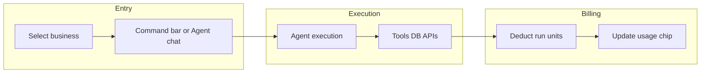

# MultiWorkAgent — UI Specification

A product UI for a **multi-tenant business operations agent** powered exclusively by **the platform agent**. One account can orchestrate tasks, databases, integrations, and workflows across **many businesses** from a single control surface.

This document describes screens, information architecture, and interaction patterns—not implementation.

---

## Product principles

| Principle | UI implication |
|-----------|----------------|
| **One agent, many businesses** | Business switcher is always visible; context (DBs, tasks, credentials) is scoped per business. |
| **Runs are the currency** | Usage, limits, and billing center on **Execution Runs**, not raw tokens. |
| **Transparent usage** | Users see *how much* each action cost in run units and token usage against the standard run cap—without needing to understand API internals. |
| **Margin-safe by design** | Concurrency caps, daily breakers, and top-up rules are visible so power users understand boundaries. |
| **Operator-first** | Dense dashboards for agencies; simplified defaults for solopreneurs (Starter). |

---

## Information architecture (top level)

```
App shell
├── Home (cross-business overview)
├── Businesses
│   ├── [Business A] — Workspace
│   ├── [Business B] — Workspace
│   └── + Add business
├── Agent
│   ├── New run / Command bar
│   ├── Run history & queue
│   └── Scheduled & automations
├── Data & integrations
│   ├── Databases & schemas
│   ├── APIs & webhooks
│   └── Files & knowledge
├── Billing & usage
│   ├── Plan & quota
│   ├── Top-up credits
│   └── Invoices
└── Settings
    ├── Account & team
    ├── Security & API keys
    └── Notifications
```

---

## Global app shell

### Header (persistent)

- **Logo / product name**
- **Business switcher** (dropdown or command palette):
  - Search businesses
  - Pin favorites
  - Badge: pending tasks, failed runs, or integration errors per business
- **Global command bar** (`Ctrl/Cmd + K`):
  - “Run agent on…” (pick business + intent)
  - Jump to DB, table, integration, or past run
- **Usage chip** (always visible for subscribers):
  - Example: `142 / 200 runs · Pro`
  - Color states: green (>25% left), amber (<25%), red (0 or overage blocked)
  - Click → Billing & usage
- **Notifications** (run completed, breaker tripped, payment failed)
- **Account menu** (plan, settings, sign out)

### Sidebar (collapsible)

Primary nav mirrors IA above. Secondary section **“Active context”** when inside a business workspace:

- Current business name + industry tag (optional)
- Quick links: Tasks, DBs, Integrations, Agent runs (filtered to this business)

### Footer of shell (optional, Starter-friendly)

One-line explainer (optional, user-facing): *“1 Standard Run ≈ 30k input + 2k output tokens.”* Link to docs. Do not name the underlying model in UI.

---

## Home — multi-business command center

**Audience:** Owners managing several entities (agencies, holding companies, serial founders).

### Layout

1. **Hero metrics row** (account-level, current billing period)
   - Runs used / included quota
   - Businesses active count
   - Runs today (with daily breaker hint: “Max 50/day per account”)
   - Concurrent runs: `0 / 2` live indicator

2. **Business cards grid**
   Each card:
   - Business name, logo, last activity
   - Mini health: DB sync status, open agent tasks, critical alerts
   - Primary actions: **Open workspace**, **Ask agent**, **View runs**
   - Overflow: settings, archive, duplicate template

3. **Recent runs feed** (all businesses, filterable)
   - Columns: time, business, summary, run units consumed, status
   - Filter: business, status, run type (chat, scheduled, automation), date range

4. **Suggested actions** (agent-generated summaries)
   - “Reconcile inventory for Store B”
   - “Migrate staging DB schema diff”
   - Each shows estimated run cost badge: `~1 run` (or fraction if under token cap)

### Empty state (first login)

Wizard: **Add first business** → connect one data source → **first guided run** (counts against quota; show “This will use ~1 run”).

---

## Business workspace

Scoped UI: everything below respects **one selected business** unless user explicitly selects “All businesses.”

### Tabs

| Tab | Purpose |
|-----|---------|
| **Overview** | KPIs, open tasks, integration health |
| **Agent** | Chat + structured runs for this business |
| **Tasks** | Human + agent task board (Kanban / list) |
| **Data** | DB connections, schemas, query sandbox (read-only by default) |
| **Integrations** | WooCommerce, Square, email, CRM, custom webhooks |
| **Activity** | Audit log: who/what changed, agent vs human |
| **Settings** | Business profile, env vars, allowed tools |

### Overview tab

- **Status strip:** “Agent can access: 2 DBs, 4 integrations” with manage link
- **Task summary:** open / in progress / blocked
- **Last 5 runs** for this business only
- **Data freshness:** last sync timestamps

---

## Agent experience

Two complementary modes: ** conversational** and ** structured execution**.

All reasoning, triage, code generation, and tool orchestration runs on **the platform agent**.

### A. Agent panel (primary)

Split view:

- **Left (60%):** Thread per business (or per “mission” within business)
- **Right (40%):** **Run inspector** — live token budget meter mapped to runs, tool calls, DB targets

#### Message types

- User messages (text, attachments, @-mentions: `@orders_db`, `@square`)
- Agent plan: numbered steps before destructive actions
- Agent result + artifacts (SQL diff, CSV, code patch, webhook payload)
- System: run metering (“This step used 0.4 of 1 standard run · agent”)

#### Pre-run confirmation (destructive or high-cost)

Modal:

- Estimated run units (against 1 standard run cap)
- Resources touched (tables, APIs)
- **Confirm run** / **Edit scope** / **Cancel**

Default: auto-approve low-risk actions under a user-configurable run budget threshold.

### B. Structured “New run” flow

For repeatable operations:

1. **Template:** Report, ETL, code change, support triage, multi-DB migration, custom
2. **Scope:** business, env (prod/staging), resources
3. **Schedule:** now / cron / webhook-triggered
4. **Review:** quota check — “After this run you will have 38 runs left”
5. **Execute** → enters queue (respects **max 2 concurrent** account-wide)

### Run queue & concurrency UI

- **Queue drawer:** pending runs across all businesses, ordered FIFO with priority toggle (Pro)
- **Concurrency banner** when at limit: “2 runs in progress. Next run starts when a slot frees.”
- Per-run progress: steps, tool calls, elapsed time

### Daily circuit breaker

If account exceeds **50 runs in 24 hours**:

- Full-width alert on Home and Agent
- Copy: limits abuse; shows reset time (UTC)
- Actions: view run log, upgrade/top-up (if quota also exhausted), contact support
- New runs disabled until reset unless admin override (future enterprise)

---

## Data & integrations UI

### Databases

- **Connection cards:** host, database name, role (read/write), last agent query
- **Schema browser:** tables, columns, row counts (cached)
- **Agent permissions matrix:** which tools can SELECT/INSERT/UPDATE/DELETE per connection
- **Sandbox:** run read-only queries; export; “Ask agent to explain this schema”

### Integrations

- **Catalog:** 109 providers across 11 categories (see `integrations_catalog.py` and `INTEGRATIONS.md`) — version control, CMS, CRM, support, databases/vector, comms, PM, automation, commerce, finance/ERP, workspace suites
- Per-business **connection store** (separate from chat DB): OAuth / API keys, encrypted, never shared across businesses
- Agent **read / write / automate** via scoped tools; destructive ops require run confirmation
- Catalog UI: search, category sections, connect per provider (flows TBD)
- **Test connection:** local ping when possible; agent-assisted validation counts as a normal run when the agent is invoked
- Webhook inbound URL per business with signing secret rotation UI
- **Product billing** for this app uses **Square**; Stripe/PayPal/etc. in the catalog are customer business integrations the agent operates

### Knowledge & files

- Upload SOPs, contracts, product catalogs
- Static portions flagged for **prompt caching** (admin badge: “Cached system context — lower input cost on repeat runs”)

---

## Tasks UI

Unified task system for human delegation and agent work.

- **Sources:** manual, agent-created, integration events (e.g. low stock)
- **Fields:** business, priority, assignee (human or “Agent”), linked run ID
- **Agent tasks** show run unit estimate (against standard run cap)
- Bulk action: “Assign selected to agent” → batches into queued runs with total quota preview

---

## Billing & usage

Central place for the **AI Service Subscription System**.

### Plan & quota (main billing page)

#### Current plan card

| Tier | Price | Quota | Shown elements |
|------|-------|-------|----------------|
| **Starter** | $19/mo | 50 runs/mo | Target copy: solopreneurs, indie hackers, small teams |
| **Pro** | $49/mo | 200 runs/mo | Target copy: startups, agencies, active developers |

- Progress bar: runs used / included
- Reset date (billing cycle)
- **Upgrade / downgrade** with proration summary (UI copy only; backend handles math)
- Link to tier comparison table

#### Execution run definition (expandable panel)

Plain language + technical footnote:

- **1 Standard Execution Run** = up to **30,000 input tokens + 2,000 output tokens**
- **All agent work** is processed with **the platform agent** and debited against that cap (**1.0×** standard run unit when fully utilized; partial units when usage is lower)

#### Usage breakdown (charts)

- Runs by day (bar)
- Runs by business (stacked bar for multi-business accounts)
- Runs by category: chat, scheduled, automation, integration-triggered (donut)
- Estimated API cost allocation (informational): ~$0.12 ceiling per run — for transparency, not user-facing billing line item

#### Concurrency & limits (transparency section)

- Max **2 concurrent** execution runs per account (live status)
- Daily breaker: **50 runs / 24h** — progress meter “34 / 50 today”

### Credit top-up (pay-as-you-go)

Visible only when user has **active Starter or Pro** subscription.

- **Package:** $10 → **+65 execution runs**
- **Rollover callout:** unused top-up credits roll to next cycles
- Purchase button → confirm → receipt
- Separate balance line: “Top-up balance: 120 runs” vs “Plan quota: 38 / 200”
- Consumption order (display logic): typically plan quota first or blended—state clearly in UI: *“Plan runs are used first, then top-up credits.”* (adjust if product rules differ)

### Invoices & payment

- Square-style list: date, amount, PDF
- Payment method, billing email, tax ID (optional)

### Starter vs Pro empty-quota states

- **0 runs left:** block new agent executions; allow read-only browsing
- CTA: top-up (if subscribed) or upgrade tier
- Show helpful nudge: “Typical tasks use up to 1 standard run each.”

---

## Settings

### Account & team (Pro-oriented)

- Members, roles: Owner, Operator, Viewer
- Viewers: no agent execute, no credential edit

### Security

- API keys for automation (rate-limited, same concurrency rules)
- Session list, 2FA
- Per-business secret scopes

### Agent behavior

- Auto-approve thresholds for low-risk runs (max run units without confirmation)
- Prompt caching indicator: on for static system docs (read-only toggle for enterprise later)

### Notifications

- Run completed/failed, quota 80%/100%, daily breaker, payment issues

---

## Cost optimization (user-visible, not hidden backend)

Surfaced in **Billing → How runs are counted** and optionally in run inspector:

| Rule | User-facing message |
|------|---------------------|
| **Prompt caching** | “Repeated context (docs, schemas) may cost less on subsequent runs in the same session.” |
| **Local pre-processing** | “Validation and parsing run in-app when possible so the remote agent is used only for agent steps.” |
| **Concurrency & breakers** | “Up to 2 runs at once; fair-use daily limit protects the platform.” |

Admins see a **margin protection** doc link—not internal percentages—in FAQ.

---

## Key user flows (summary)



1. **Agency adds 12 clients:** Businesses grid → bulk import → per-business integrations → Home shows aggregated usage.
2. **Solopreneur on Starter:** Single business, usage chip prominent, top-up when month ends heavy.
3. **Heavy code refactor:** User triggers run → confirmation shows **~1 standard run** → queue if at concurrency 2.
4. **Morning review across businesses:** Suggested actions at **~1 run each**; user batch-approves with quota preview.

---

## Responsive & accessibility notes

- **Mobile:** Business switcher + usage chip + notifications; full agent chat; defer schema browser to tablet+
- **Keyboard:** Command palette for all primary actions
- **Screen readers:** Run status announcements; quota progress as `aria-valuenow`
- **Color:** Do not rely on color alone for quota states (icons + text)

---

## Visual design direction (non-binding)

- **Tone:** Professional operations tool—not a toy chatbot
- **Density:** Pro/agency users prefer compact tables; Starter gets slightly more whitespace
- **Agent thread:** Distinct styling for plan vs result vs system metering messages
- **Trust:** Clear labels when agent touches production DBs or billing integrations

---

## Out of scope for this UI spec

- Backend billing implementation (Square products, webhooks)
- Exact token counting algorithms and caching internals
- Enterprise custom tiers, SSO, and breaker overrides

---

## Document metadata

- **Purpose:** UI/UX specification for the MultiWorkAgent product surface
- **Model:** Internal provider (not shown in user-facing UI)
- **Subscription rules:** As defined in the AI Service Subscription System (Starter, Pro, top-up packs, run definitions, concurrency, and daily limits)
